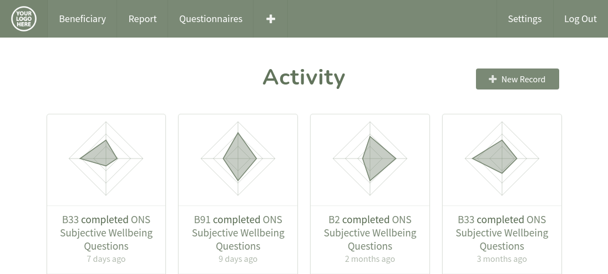

_Tired of purple?_ Whilst purple is lovely, wouldn't it be better to see your organisation's colours and logo within Impactasaurus? Well now you can!

We are excited to announce custom branding within Impactasaurus. This allows you to make Impactasaurus even more yours:

**Your subdomain**: your team and beneficiaries will be able to access Impactasaurus from a branded URL, such as yourbrand.impactasaurus.org

**Your logo**: the Impactasaurus logo shown in the app and login page will be replaced with your logo

**Your colours**: your main brand colour can be used throughout the application's user interface and the chart colours can be adjusted to match your brand

If you are interested in setting this up, please [contact support](/support) and we will work with you to create your very own white labelled Impactasaurus.
