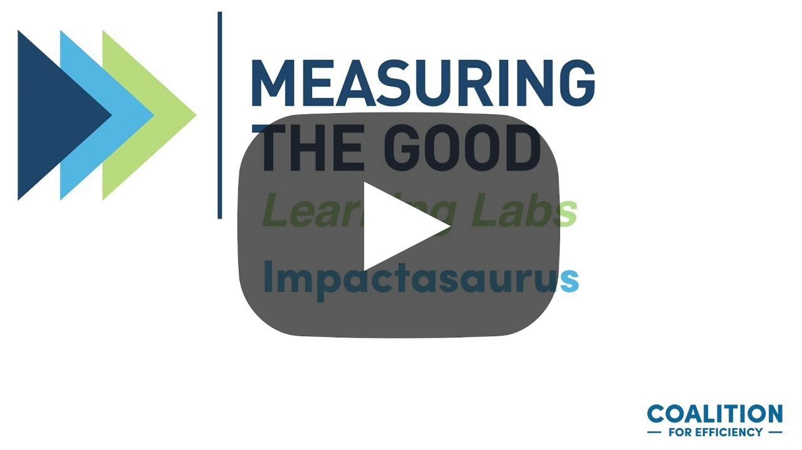

The [Coalition for Efficiency](http://www.cfefficiency.org.uk/) runs a brilliant series of webinars and talks called Learning Labs. Last year Dan presented a session introducing Impactasaurus, which you can watch below. It covers Impactasaurus' background, vision and a walkthrough of the application and what it offers - we hope you enjoy!

 

 

 
