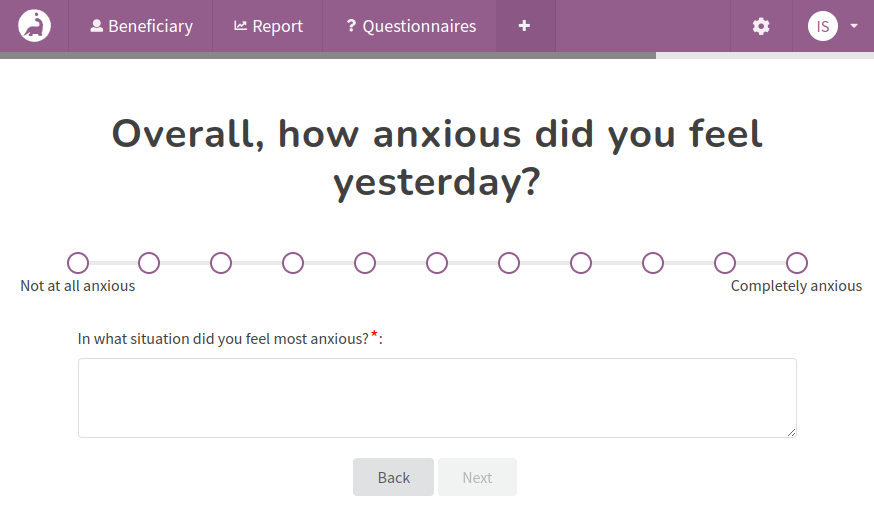

The main goal of Impactasaurus is to provide an easy way to measure soft outcomes. For most charities, this will be measuring the positive impact they have on the individuals they help. The optimal way to measure change in people is through scale questions, which is why questionnaires in Impactasaurus are formed this way. 

When completing a questionnaire, it is extremely useful for the beneficiary or facilitator to capture notes, actions and any goals which may have been agreed to. To support this, Impactasaurus provides a comment box under each question and at the end of the questionnaire. With our latest release this comment box can be customised so that you can specify what free text you would like the user to provide. Furthermore you can force the user to provide some text, to avoid them moving on before providing a response. Finally, if comments aren't required, the comment boxes can be removed, simplifying the questionnaire for your beneficiaries.

To configure these options, head to the questionnaires page and select a questionnaire. The comment box provided with each question can be configured by editing the question. The controls to adjust the comment box at the end of the questionnaire can be found under the questionnaire's general options.
