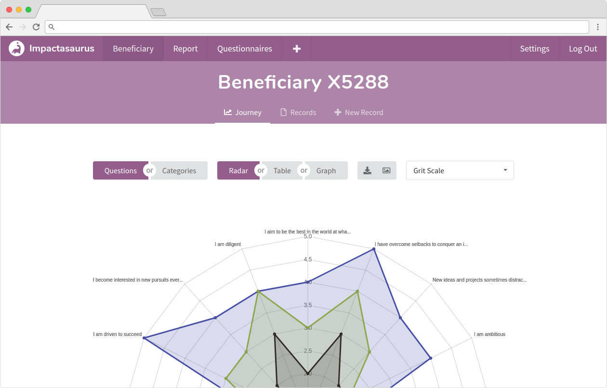

Dan recently answered some questions for [What Charity](https://whatcharity.com/), where he discussed Impactasaurus' origin, why charities need to understand their impact and how Impactasaurus can help:

* * *

**What does Impactasaurus do?**

Impactasaurus is a tool for monitoring and reporting on soft outcomes. It is ideal for charities who help beneficiaries over time and are able to assess beneficiaries on at least two occasions.

The tool provides distance travelled analysis, measuring impact as the progress made by the beneficiary as a result of the charity’s intervention. It can provide impact reports for individual beneficiaries, across all beneficiaries or a subset (based on location, type of intervention or demographics).

It is free and simple, perfect for small and medium-sized charities.

**Why did you and your team decide to create this product?**

The team behind Impactasaurus are all volunteers. We wanted to give back to society and felt that exploiting our software skills was the best method to achieve this.

The idea for Impactasaurus grew out of a [Social Coder](https://socialcoder.org/Home/Index) project, where we helped create a custom outcome monitoring tool for a small charity.

It became clear that the commercial offerings at the time were not suited to small charities, either being too expensive or too complex. Once we completed the project, we decided to generalise the solution, so that more charities could benefit.

Since then, we have worked for two years extending the tool’s functionality, with the invaluable feedback from hundreds of charities. As we are volunteers and the system is cheap to run, we have been able to offer it to charities at no cost.

**Why is it important for a charity to monitor and know their impact?**

There are many benefits to monitoring your impact. The obvious benefit is attracting funding, many grants and donors now expect to understand how their money will be used and what social impact it will achieve.

However, I believe the real benefit is driving positive change. As Peter Drucker famously said “If you can’t measure it, you can’t improve it”. What this means is that you can’t efficiently improve your approaches and activities without understanding how effective they are in achieving your goals.

Once you can measure your impact, you can experiment with new ideas and see whether they improve your impact. If nurtured, this can lead to a culture of innovation, unlocking the potential for a step change in a charity’s ability to enact social change.

**How well do charities currently monitor and understand their impact?**

Impact is a very complex thing to measure, as it takes time, effort and the right tools. As such, most charities have only taken the first step towards understanding their impact – measuring their outputs. Outputs detail what a charity has done or produced, they are easy to measure and make for impressive impact reports. Whilst they are critical in understanding reach, they do not explain the difference the charity has made.

I would encourage charities to take the next step and measure their outcomes. Outcomes describe the result of your organisation’s efforts. If the outcomes being measured relate to your organisation’s goals, there is scope to learn and improve, realising what I feel is the biggest benefit to impact measurement.

**Tell us a little bit more about how a charity uses the product…**

To start, charities should decide on a questionnaire which can be used to measure their desired outcomes. Impactasaurus has a catalogue of questionnaires to select from, and if none of them suit, charities can create their own. Beneficiaries should answer the questionnaire before and after intervention at a minimum. The answers provided are stored in the system and used to analyse the impact, by measuring the distance travelled.

Impact reports can be generated for individuals or by aggregating the data from multiple beneficiaries. Viewing individual beneficiaries is great for monitoring their progress and reacting to their needs. Whilst analysing impact across all your beneficiaries is ideal for grant applications, stakeholder reporting, and self-improvement.

**How can charities sign up for your free service?**

To sign up, head to <https://impactasaurus.org/signup/>, it’s completely free and only takes a couple of minutes to get started!
