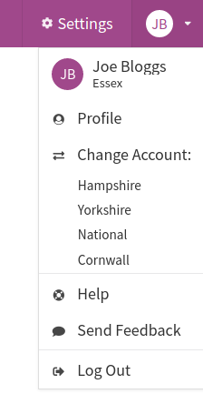

Impactasaurus' vision is to help all organisations, benefiting society, to understand their social impact.
In the past, we have focused our efforts mainly on smaller organisations, as they lacked suitable software to capture this data.
But it is becoming clear that larger organisations are also looking for simple, configurable and modular tools.

Today we have launched a feature called organisation switching, which is our first step towards supporting larger organisations.
In the past, users could only see and record data for a single organisation within Impactasaurus.
With organisation switching, users can now belong to many organisations and easily switch between them within the app.

So where is this useful?

-   National organisations can provide local entities with their own independent Impactasaurus, whilst still allowing individuals from the national organisation to move between them for reporting and standardisation purposes.
-   Volunteers, funders and consultants, who may help many organisations, can easily switch between them within the app.
-   Organisations with stricter security requirements may wish to create a secondary organisation, with limited access, for their sensitive data.

Getting started with organisation switching is simple, just request an invite from the organisations you work with and login before accepting them. Once you belong to more than one organisation, you can switch between them from the user dropdown menu in the top right of the app:

If you would like to create a second organisation, our [support team](/support) would love to help, just drop us an email.

Stay tuned for more features.
