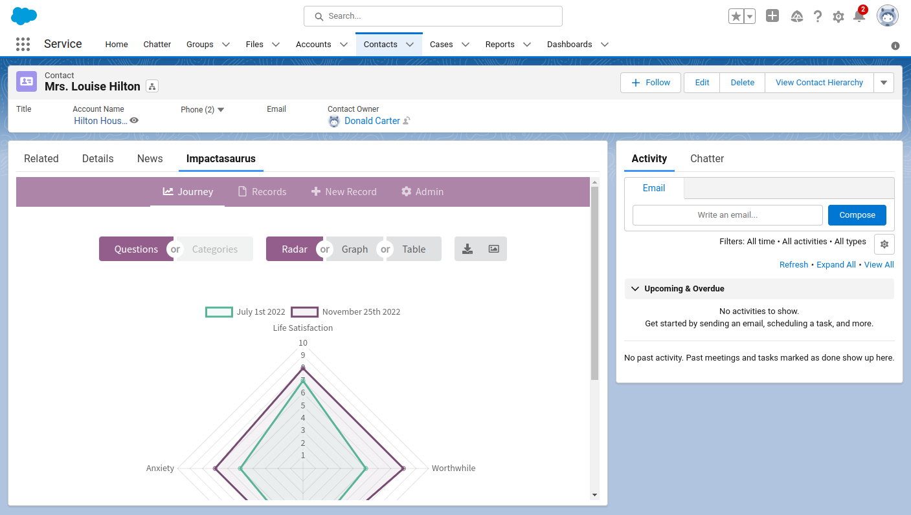
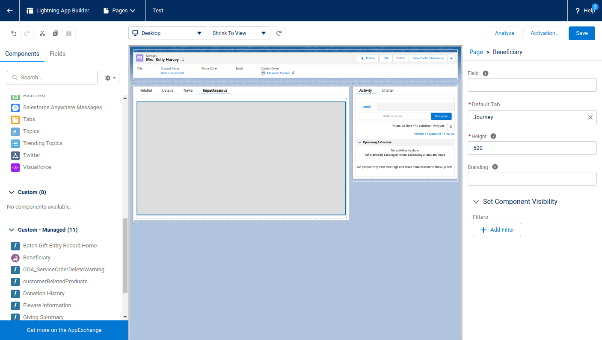

For those of you using [Salesforce's Nonprofit Success Pack](https://www.salesforce.org/nonprofit/), you can now use Impactasaurus directly from Salesforce using our new plugin!

The Impactasaurus plugin offers a lightning component which you can bring into your Contact or Account lightning pages. The component shows the beneficiary's page within Impactasaurus, allowing you to see the beneficiary's soft outcome data, generate questionnaire links or gather questionnaire responses all from Salesforce.

When configuring the component you can adjust which field or property of the object is used as the beneficiary ID within Impactasaurus. There is also an option to adopt your Impactasaurus custom branding within the plugin.

To get access to the Impactasaurus Salesforce plugin, please drop an email to our [support team](/support) and we can guide you through the relatively simple installation.

So, if you are looking for an easy to use and free social impact tool within Salesforce, give Impactasaurus a try!
