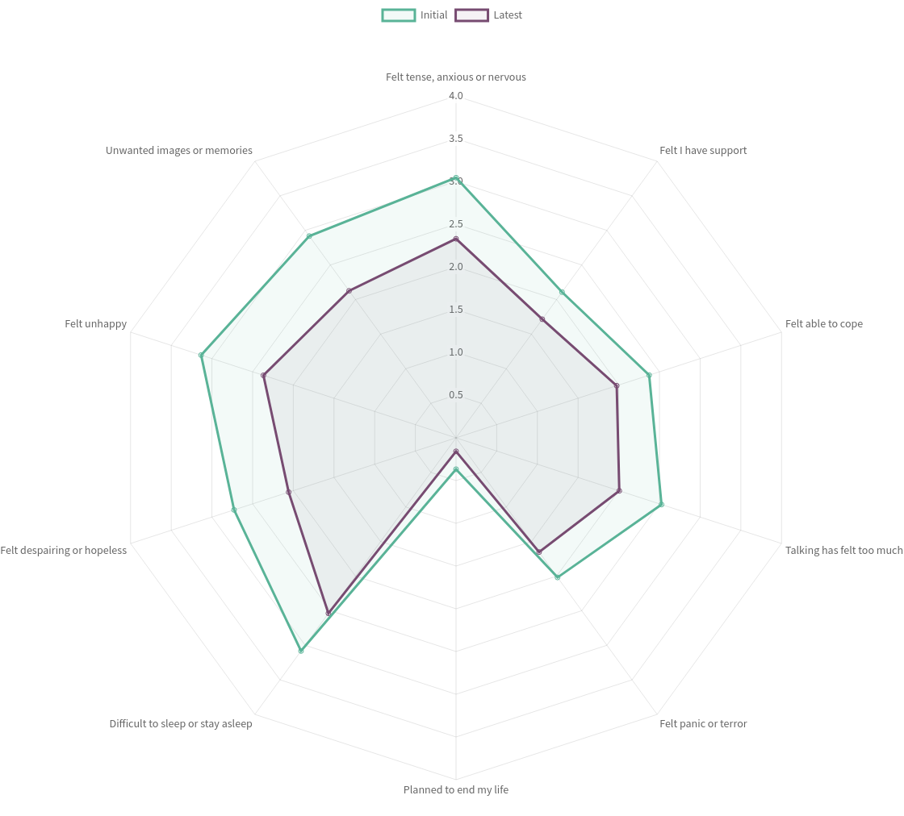

As part of a new blog series, we are shining the spotlight on organizations that have fully embraced impact measurement. [Ruth Cooke](https://www.linkedin.com/in/ruth-cooke-0aab6ab9) from [Solace](https://www.solace-uk.org.uk/) has kindly answered some questions about how they approach and benefit from measuring their impact.

**Tell us about Solace and the work that you do?**

Solace is a therapeutic wellbeing service for refugees and asylum seekers (RAS). Established in 2006, we now work with over 500 people each year. We cover most of Yorkshire and the Humber region, so our team has always been part remote, but more so since the pandemic.

Over 15 years ago, impact management was a relatively unexplored concept in the wider third sector and back then Solace, like many small start-up charities, was put together on a shoe string. Over the years Solace has grown, we now have more than 25 therapists working across our region. Nearly all of our work is contract work through targeted grants for different demographics within the RAS sector, and increasingly funders want to see the evidence of the impact and outcomes of their investment.

**How did your impact measurement process develop?**

In Solace’s more recent times, a well-established database ([CiviCRM](https://civicrm.org/)) meant we already had our outputs in good order. We already knew how many people we were working with, how often, and how many no-shows or cancellations we saw. We had details of demographics and therapeutic case notes, so what we needed next was to think about monitoring the difference that we make.

The growth of the organisation has also allowed for more focus on impact management for our own purposes too (not just for funders). We launched an internal impact management drive in 2020, and Impactasaurus played a big part in our monitoring processes. We didn’t want a platform that duplicated what we already did. We wanted a platform that monitored distanced travelled for our clients’ wellbeing, that replaced paper files and that was easy to use for even the most IT-challenged of our remote team - and didn’t cost the earth! Impactasaurus has ticked all the boxes.

**What tool do you use to measure your soft outcomes?**

We use ‘Clinical Outcomes in Routine Evaluation 10’ (CORE 10) readings as our standard measuring tool. Some therapists like to use others such as the IES reading for trauma clients, but that is for their own therapeutic use, and isn’t measured as an organisation. Our target is for most clients to have a CORE 10 reading taken every 6 sessions or more. Due to the uniquely difficult circumstances of our service users, CORE scores can be erratic, and we know that. Clients may have one or more negative asylum claims over many years (decades in some cases), our clients may have an accommodation crisis, or threats of detention or even deportation. Therefore, we are not looking for perfect outcomes, we are looking for a true reflection of our clients’ journeys. It is useful to be able to record notes about why a sudden high or low reading appears. We also have clients where impact questions are not appropriate, and we won’t use these tools if it’s not right for them.

We are reassured to see that the overall pattern for the organisation is a significant improvement across all elements of the CORE 10 reading. The radar graphs on Impactasaurus are particularly useful for visually and simply demonstrating that change.

**What other information do you collect?**

Aside from the core measurements we also take feedback on general wellbeing and feedback on the service itself when a client is discharged using an online form. We have had this professionally translated into different languages so we can just text a link to our clients. (Google translate is sufficient for incoming responses). We encourage constructive feedback, and collate and action any comments that can help us to improve. In addition - once a year we take a similar snapshot survey from a selection of service users who are currently engaging with our service.

We use case studies and interviews to give more in depth demonstrations of our work with clients, and the impact we have on their lives, their families and communities. We often find that our service users are very keen to ‘give back’ and want to shout about what a great service we are! Occasionally those who are really keen, and in a stable enough situation in their lives will even go on to record an interview talking about their wellbeing and the journey they have made.

**What's next?**

Our next milestone is to really understand our data and evaluate in a way that can shape our future service. None of this has happened overnight, and the impact management roll out requires patience and perseverance – especially when it is new to some practitioners, but we are making progress all the time!
