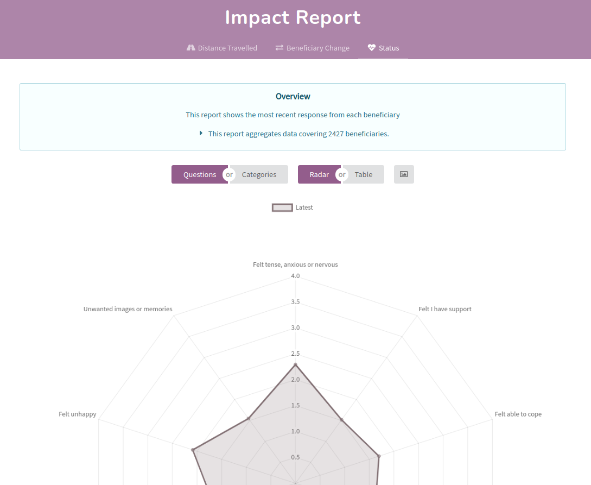

In the past, Impactasaurus focused solely on longitudinal studies, where questionnaires are answered before and after an intervention. The two reports in the app, 'distance travelled' and 'beneficiary change', assess impact by comparing the answers provided after intervention to those collected before. Studies such as these are ideal for soft outcomes where it is difficult to make measurements of the outcomes being affected. 

However, many use cases don't require such formal evaluation. We have had many requests from users to support cross sectional studies, where a single questionnaire is answered, typically after an intervention. These studies don't provide the same level of insight into your impact, but they do have their uses. It may be that you are after some informal feedback on your service, or looking for a lighter weight approach to impact measurement.

To support this use case, we have released the status report. This new report aggregates the most recent response from each beneficiary and presents the result in a radar chart (aka star chart) or in tabular form. Because it uses only the most recent response from each beneficiary, it can be used in situations where a beneficiary has only provided one response to a questionnaire.

In addition to cross sectional studies, this new report can be beneficial for longitudinal studies too. If you work with groups of beneficiaries, you can use the status report to tailor your intervention to suit your beneficiaries' needs. Once your beneficiaries have answered the questionnaire before your intervention, you can use the status report to get insight into the group's starting point. You can then focus on the aspects which require most work, delivering the most benefit to your beneficiaries.

To try it out, generate a report then navigate to the 'status' tab. Like the other reports in the system, it supports time range and tag filtering, allowing you to drill down to the beneficiaries of interest. We hope you enjoy it!
